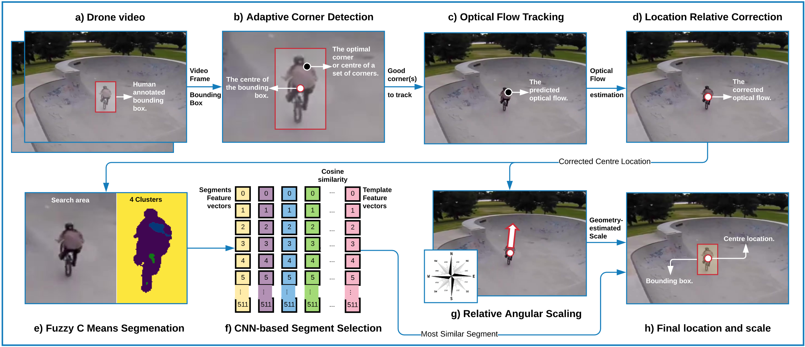
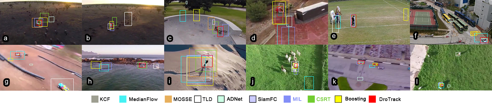

# DroTrack

**DroTrack: High-speed Drone-based Object Tracking Under Uncertainty**<br />
[Ali Hamdi](https://scholar.google.com.au/citations?user=Q5qW1rcAAAAJ&hl=en),[Flora Salim](http://florasalim.com/), [Du Yong Kim](https://sites.google.com/site/duyongkim/)<br />
**FUZZ-IEEE 2020** <br />
**[[Paper](https://arxiv.org/abs/2005.00828)] [[Video](https://youtu.be/i0oiodX9o6g)]** <br />

### Bibtex
If you find this code useful, please consider citing:

```
@inproceedings{hamdi2020drotrack,
    title={DroTrack: High-speed Drone-based Object Tracking Under Uncertainty},
    author={Ali Hamdi, Flora Salim, Du Yong Kim},
    booktitle={Proceedings of the IEEE conference on Fuzzy Systems (FUZZ-IEEE)},
    year={2020}
}
```
<br />

<div align="center">
  
</div>

### Results

<div align="center">
  
</div>

<div align="center">
  
</div>

### Demo
<div align="center">
    
    
    
    
    
    
    
    
    
    
    
    
    
    
</div>

**[[Video](https://youtu.be/i0oiodX9o6g)]**

## License
Licensed under an MIT license.